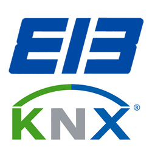

ioBroker: alternative eib(knx) Adapter
==============

Connecting the eib(knx) bus to iobroker. 
extra features:
    The Name of the Groupaddresses are used in iobroker,
    Datasubtypes are supportet. (Providing units, min, max etc.)
    Datatransformation with full configurable formulars.

### 0.0.0 (2016-11-08)
Pre Release
Known Bugs and Issues:
Configuration page is not yet implementet. EIBD server and port is hardcoded in eibd.js.
DPT might not allways be correct for DPT which are not covered by the eibd library.

## Install & Configuration

1st.)   Install eibd and configure it. Test if all runs correctly.
2nd.)   Fire up your ETS and export your groupaddresses to xml. (Only 3-leve structure is tested right now.)
3rd.)   Write down the complete DPT for each groupaddress. Write down wheter the ga is r,w,rw. You will find those          informations within ets.
4rd.)   Open the exportet xml file and append the information received from step 3 to the groupaddress.
You can append it on a single ga or on a middlegroup. If choosen a middlegroup each ga within the middlegroup will reflect those values as long as there are no individual values set.

-----------------------------------------------------------

-----------------------------------------------------------

## Usage

## License

The MIT License (MIT)

Copyright (c) 2015 ruhigundrelaxed

Permission is hereby granted, free of charge, to any person obtaining a copy
of this software and associated documentation files (the "Software"), to deal
in the Software without restriction, including without limitation the rights
to use, copy, modify, merge, publish, distribute, sublicense, and/or sell
copies of the Software, and to permit persons to whom the Software is
furnished to do so, subject to the following conditions:

The above copyright notice and this permission notice shall be included in
all copies or substantial portions of the Software.

THE SOFTWARE IS PROVIDED "AS IS", WITHOUT WARRANTY OF ANY KIND, EXPRESS OR
IMPLIED, INCLUDING BUT NOT LIMITED TO THE WARRANTIES OF MERCHANTABILITY,
FITNESS FOR A PARTICULAR PURPOSE AND NONINFRINGEMENT. IN NO EVENT SHALL THE
AUTHORS OR COPYRIGHT HOLDERS BE LIABLE FOR ANY CLAIM, DAMAGES OR OTHER
LIABILITY, WHETHER IN AN ACTION OF CONTRACT, TORT OR OTHERWISE, ARISING FROM,
OUT OF OR IN CONNECTION WITH THE SOFTWARE OR THE USE OR OTHER DEALINGS IN
THE SOFTWARE.
